# AtomZero Technical Design Document

> **Engine Version**: Godot 4.6.3  
> **Game Name**: AtomZero  
> **Game Version**: `2026.6.30` (Release, uses SemVer range matching detection)  
> **Document Version**: v2026.6.30  
> **Scope**: The base game is an absolutely empty framework; all functionality is implemented through Mods  

---

## Table of Contents

1. [System Architecture Design](#1-system-architecture-design)
2. [Mod Classification and Management System](#2-mod-classification-and-management-system)
3. [File System Structure Specification](#3-file-system-structure-specification)
4. [Mod Development Specification](#4-mod-development-specification)
5. [Loading Flow Design](#5-loading-flow-design)
6. [API Design](#6-api-design)
7. [Persistence Scheme](#7-persistence-scheme)
8. [Debug and Log System](#8-debug-and-log-system)
9. [Security Mechanism](#9-security-mechanism)
10. [Performance Optimization Strategy](#10-performance-optimization-strategy)

---

## 1. System Architecture Design

AtomZero adopts an "Empty Shell + All-Mod-Driven" architecture. The base game only provides the Mod Loader core, event bus, virtual file system, and basic service interfaces; all gameplay, blocks, entities, UI, and world generation are provided by Mods.

### 1.1 Overall Architecture Diagram

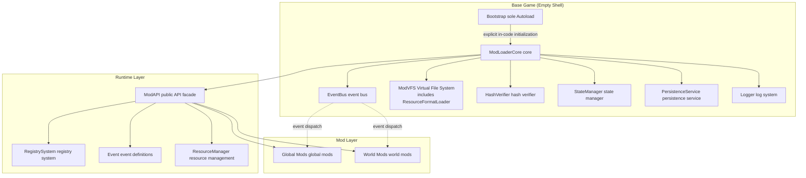

### 1.2 Core Module Division and Responsibility Definition

| Module | Class Name | Responsibility | Initialization Method |
|------|------|------|-----------|
| **Bootstrap** | `Bootstrap` | The sole Autoload; engine startup entry point, instantiates and initializes all core services in code order within `_ready()` | Autoload |
| **ModLoader Core** | `ModLoaderCore` | Mod scanning, dependency resolution, load order sorting, load/unload scheduling | Bootstrap code initialization |
| **Event Bus** | `EventBus` | Event registration, subscription, dispatch; high-frequency events use dedicated fast channels | Bootstrap code initialization |
| **Virtual File System** | `ModVFS` | Custom ResourceFormatLoader based on `mod://` protocol, unifying multi-Mod resource access and overrides | Bootstrap code initialization |
| **Hash Verifier** | `HashVerifier` | Mod file hash whitelist verification (TOFU model), integrity check | Bootstrap code initialization |
| **State Manager** | `StateManager` | Tracks current state (Starting/Main Menu/World Loading/World Running), drives World Mods switching | Bootstrap code initialization |
| **Persistence Service** | `PersistenceService` | Read/write isolation of Global/World two-level config and data | Bootstrap code initialization |
| **Log System** | `Logger` | Tiered logging, Mod source tagging, log file flushing to disk, auto-opens log file on crash | Bootstrap code initialization |
| **Registry System** | `RegistrySystem` | Unified management of block/item/entity/recipe registries | Bootstrap code initialization |
| **ModAPI Facade** | `ModAPI` | Unified entry point exposed to Mods, aggregating the above capabilities | Bootstrap code initialization |

> **Note**: This design **does not include** a permission manager (PermissionManager) or security verifier (SecurityVerifier). See §9 Security Mechanism for details.

### 1.3 Single Bootstrap Autoload + Explicit In-Code Initialization

**Only one Autoload** is registered in `project.godot`, avoiding multi-Autoload order dependencies and circular initialization issues:

```ini
[autoload]

Bootstrap="*res://core/bootstrap/Bootstrap.gd"
```

All core services are instantiated by `Bootstrap` in explicit code order; dependencies are readable, testable, and assertable in code:

```gdscript
# core/bootstrap/Bootstrap.gd
extends Node

var logger: Logger
var hash_verifier: HashVerifier
var event_bus: EventBus
var mod_vfs: ModVFS
var persistence: PersistenceService
var registry: RegistrySystem
var mod_loader: ModLoaderCore
var state_manager: StateManager
var mod_api: ModAPI

func _ready() -> void:
	_init_services()
	mod_loader.bootstrap()

func _init_services() -> void:
	logger = Logger.new()
	logger.init()

	hash_verifier = HashVerifier.new()
	hash_verifier.init(logger)

	event_bus = EventBus.new()
	event_bus.init(logger)

	mod_vfs = ModVFS.new()
	mod_vfs.init(logger)

	persistence = PersistenceService.new()
	persistence.init(logger)

	registry = RegistrySystem.new()
	registry.init(logger)

	mod_loader = ModLoaderCore.new()
	mod_loader.init(logger, hash_verifier, event_bus, mod_vfs, persistence, registry)

	state_manager = StateManager.new()
	state_manager.init(logger, event_bus)

	mod_api = ModAPI.new()
	mod_api.init(logger, event_bus, mod_vfs, persistence, registry, state_manager)
```

> Each `init()` receives already-initialized dependencies; the dependency chain is linearly visible in code. Adding a new service only requires inserting the corresponding line in `_init_services()` without modifying `project.godot`.

### 1.4 Design Principles

1. **Empty Shell Principle**: The base game contains no gameplay logic; it only provides infrastructure.
2. **Dependency Injection Principle**: Mods obtain services through `ModAPI` and do not directly access internal implementation details.
3. **Event-Driven Principle**: Inter-Mod communication preferably goes through EventBus, avoiding hard references.
4. **Isolation Principle**: World Mods data is strongly bound to the world save; fully unloaded on world switch.
5. **No Exception Isolation Principle**: When a Mod fails to load, an error is reported and the log is retained; no runtime exception capture is performed; the log file is automatically opened on crash. See §8.3 for details.
6. **No Permission Sandbox Principle**: No permission control system is provided, no code signing; only hash whitelist integrity verification is provided. See §9 for details.

---

## 2. Mod Classification and Management System

AtomZero divides Mods into two categories: **Global Mods** and **World Mods**. The core difference between the two lies in **scope** and **lifecycle**.

### 2.1 Global Mods

| Dimension | Description |
|------|------|
| **Scope** | Process-level, effective across all worlds |
| **Storage Directory** | `mods/` (Development Mode `res://mods/`, Release Mode `<writable root>/mods/`) |
| **Load Timing** | Game startup Bootstrap phase, completed before the main menu appears |
| **Unload Timing** | Unloaded on process exit; generally not unloaded during runtime (data hot reload supported, see §5.4) |
| **Load Priority** | Higher than all World Mods |
| **Typical Use Cases** | Core block library, base rendering layer, network protocol, main menu UI, audio engine, input system |
| **Data Persistence** | Config stored in `mods/<mod_id>/config/`, global data stored in `mods/<mod_id>/data/` |
| **Event Subscription** | Can subscribe to all events (startup, world load, world unload, tick, etc.) |

### 2.2 World Mods

| Dimension | Description |
|------|------|
| **Scope** | Single world isolated, only effective while that world is running |
| **Storage Directory** | `saves/<WorldName>/mods/` |
| **Load Timing** | Loaded when the player enters the corresponding world (after `WorldLoadStart` event) |
| **Unload Timing** | Unloaded when the player exits that world (`WorldUnloadStart` event triggered) |
| **Load Priority** | Lower than Global Mods; within the same world, sorted by dependency topological sort |
| **Typical Use Cases** | World-specific gameplay, custom biomes, story scripts, world-specific rules |
| **Data Persistence** | Config stored in `saves/<WorldName>/mods/<mod_id>/config/`, world data stored in `saves/<WorldName>/mods/<mod_id>/data/` |
| **Event Subscription** | Only receives events during the world's active period; auto-unsubscribed on unload |

### 2.3 Lifecycle Comparison Diagram

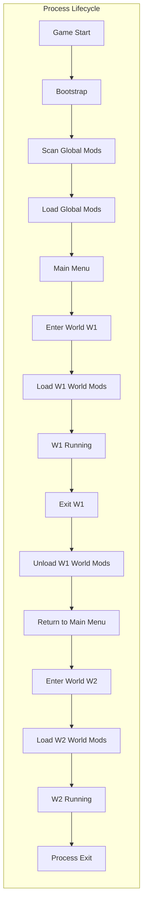

### 2.4 World Isolation Mechanism

To ensure World Mods do not pollute each other, the following isolation strategies are adopted:

1. **Namespace Isolation**: Resources registered by each World Mod are automatically prefixed with `world.<world_id>.`, avoiding conflicts with Global Mods resources.
2. **Event Scope**: EventBus maintains an independent subscription context `WorldEventContext` for each world, cleared uniformly on world unload.
3. **VFS Mount Point Isolation**: World Mods mount to the `mod://world/<world_id>/` virtual path; Global Mods mount to `mod://global/<mod_id>/`.
4. **Registry Partitioning**: `RegistrySystem` maintains an independent partition for each world, released as a whole on world unload.
5. **Script Instance Isolation**: The main class instance of a World Mod is released when the world is destroyed; cross-world static state is not allowed (use `world_storage` provided by `ModAPI` to transfer small amounts of necessary data).

#### 2.4.1 Cross-Layer Dependency Rules (Important)

- **Global Mod can depend on content provided by World Mod**: Not allowed. Global Mods load before World Mods, at which point World Mods do not yet exist.
- **World Mod can depend on content provided by Global Mod**: Allowed. When World Mods load, all Global Mods are already ready.
- **Reverse cross-layer dependency (Global Mod depending on World Mod) is not supported**: This design explicitly does not implement such reverse dependency mechanism. If a Global Mod needs to adjust behavior based on the presence of a World Mod, it should handle this in the `_on_world_load()` callback via runtime detection means such as `ModAPI.world.is_world_loaded()`, rather than through static dependency declarations.

### 2.5 World Mods Loading/Unloading Flow

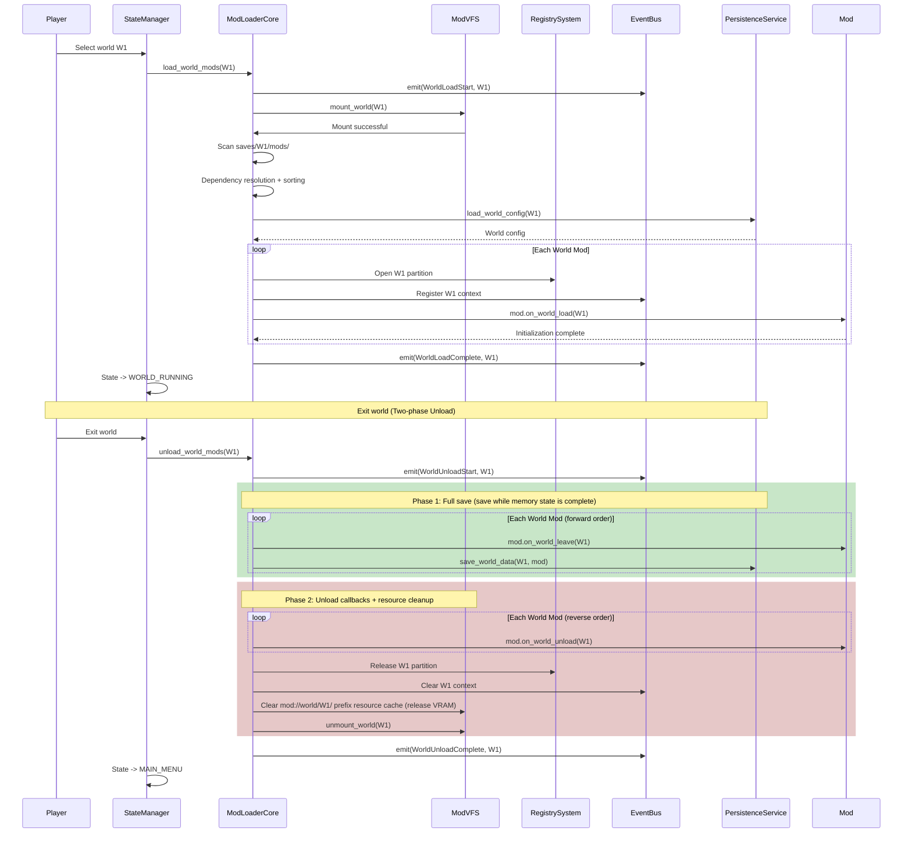

> **Two-phase Unload (Important)**: The unload flow is divided into two phases, ensuring that crashes do not corrupt save data.
>
> - **Phase 1 (Full Save)**: Before calling any unload callbacks, iterate through all World Mods, calling `_on_world_leave()` and saving their runtime data. At this point the memory state is complete and the saved data is valid.
> - **Phase 2 (Unload Cleanup)**: Only after all data has been saved, `_on_world_unload()` is called for memory cleanup, releasing registry partitions and clearing resource caches.
>
> If a Mod's `_on_world_unload()` callback in Phase 2 crashes, since Phase 1 has already completed the full save, the save data will not be corrupted, and the world can be loaded normally after restart.
>
> Mods should complete data organization in `_on_world_leave()` (writing in-memory temporary state into the data dictionary); `_on_world_unload()` only does memory cleanup and should not modify data that needs to be saved.

> **VRAM Cache Clearing**: In Phase 2, ModVFS clears all resource cache references with the `mod://world/<world_id>/` prefix, ensuring that World Mod texture/model resources are released from VRAM after world unload, preventing frequent world switches from causing VRAM accumulation overflow. The `mod://global/` prefix cache of Global Mods is unaffected.

> **Note**: This flow does not include exception isolation. If a World Mod's `on_world_load` or Phase 2 `on_world_unload` callback throws an error, the current flow will be interrupted and the game may crash. Logger automatically opens the log file on crash. See §8.3 for details.

### 2.6 Data Persistence Scheme Overview

| Data Category | Storage Location | Format | Lifecycle |
|---------|---------|------|---------|
| Global Mod config | `mods/<mod_id>/config/` | JSON | Cross-process |
| Global Mod runtime data | `mods/<mod_id>/data/` | JSON / Binary | Cross-process |
| World Mod config | `saves/<WorldName>/mods/<mod_id>/config/` | JSON | Bound to world |
| World Mod runtime data | `saves/<WorldName>/mods/<mod_id>/data/` | JSON / Binary | Bound to world |

> See §7 Persistence Scheme for details.

---

## 3. File System Structure Specification

### 3.1 Development Mode Directory Structure

```
res://
├── project.godot
├── icon.svg
├── core/                           # Base game core (implementation details not exposed)
│   ├── bootstrap/
│   │   └── Bootstrap.gd            # The sole Autoload
│   ├── loader/
│   │   ├── ModLoaderCore.gd
│   │   ├── ModDescriptor.gd         # Mod metadata descriptor object
│   │   ├── ModInstance.gd           # Mod runtime instance
│   │   └── DependencyResolver.gd    # Dependency topological sort
│   ├── event/
│   │   ├── EventBus.gd
│   │   ├── EventContext.gd
│   │   └── events/                  # Built-in event definitions
│   ├── vfs/
│   │   ├── ModVFS.gd
│   │   └── ModResourceFormatLoader.gd  # Custom ResourceFormatLoader
│   ├── registry/
│   │   └── RegistrySystem.gd
│   ├── persistence/
│   │   └── PersistenceService.gd
│   ├── security/
│   │   └── HashVerifier.gd          # Hash whitelist verification (TOFU)
│   ├── state/
│   │   └── StateManager.gd
│   ├── api/
│   │   ├── ModAPI.gd                # Public API facade
│   │   └── interfaces/              # Interfaces implemented by Mods
│   │       ├── IMod.gd              # Mod main entry interface
│   │       ├── IGlobalMod.gd
│   │       └── IWorldMod.gd
│   └── logging/
│       └── Logger.gd
├── mods/                            # ★ Global Mods storage directory
│   ├── atom_core_blocks/
│   │   ├── mod.json                 # Mod metadata
│   │   ├── mod.gd                   # Mod main entry
│   │   ├── blocks/                  # Block definitions
│   │   ├── textures/
│   │   ├── config/                  # This Mod's config (generated at runtime)
│   │   └── data/                    # This Mod's runtime data (generated at runtime)
│   └── atom_ui_framework/
│       └── ...
├── saves/                           # ★ World save root directory
│   ├── WorldName1/                  # User-defined world name
│   │   ├── world.json               # World metadata
│   │   ├── region/                  # Chunk data
│   │   └── mods/                    # ★ WorldName1-specific World Mods directory
│   │       ├── adventure_quest_pack/
│   │       │   ├── mod.json
│   │       │   ├── mod.gd
│   │       │   ├── config/          # This Mod's config in this world
│   │       │   └── data/            # This Mod's data in this world
│   │       └── custom_biomes/
│   │           └── ...
│   └── WorldName2/                  # User-defined world name
│       ├── world.json
│       ├── region/
│       └── mods/                    # ★ WorldName2-specific World Mods directory
│           └── ...
└── doc/                             # Documentation directory
	└── ModLoader_Technical_Design.md
```

### 3.2 Release Mode Directory Structure Specification

After packaging, `mods/` and `saves/` must be located in a **writable location** (game export root directory); the `core/` kernel is packaged with the PCK as read-only. When exporting with Godot, the kernel is packaged into the PCK via `--export-pack`; at runtime, `OS.get_executable_path()` locates the directory of the executable as the game export root directory.

**In Release Mode, Global Mods are distributed as `.zip`** (see §4.3.3 Release Mode Mod Packaging Specification for details). The `.zip` contains pre-imported resources (`.godot/imported/` cache); on first load, it is extracted to `.cache/<mod_id>/` and then loaded by `ResourceLoader`, bypassing the issue of missing `.import` pipeline in the release build. World Mods are also stored as `.zip` in `saves/<WorldName>/mods/`.

```
<game root directory>/
├── AtomZero.exe / AtomZero.app      # Executable
├── AtomZero.pck                      # Core PCK (read-only)
├── mods/                             # ★ Global Mods storage directory (writable)
│   ├── atom_core_blocks.zip          # ★ Release Mod packaged as .zip (with pre-imported resources)
│   ├── atom_ui_framework.zip
│   └── ...
├── .cache/                           # ★ Cache directory (.zip extraction + dependency resolution, generated at runtime, can be cleaned)
│   ├── mod_cache.json                # Dependency resolution result cache (§10.1.3)
│   ├── atom_core_blocks/             # Extracted mod directory (with .godot/imported/)
│   │   ├── mod.json
│   │   ├── mod.gd
│   │   ├── manifest.json
│   │   ├── .godot/imported/          # Pre-imported resource cache
│   │   └── ...
│   └── atom_ui_framework/
├── saves/                            # ★ World save root directory (writable)
│   ├── WorldName1/
│   │   ├── world.json
│   │   ├── region/
│   │   └── mods/                     # ★ WorldName1-specific World Mods directory (.zip format)
│   │       ├── adventure_quest_pack.zip
│   │       └── ...
│   └── WorldName2/
│       ├── world.json
│       ├── region/
│       └── mods/                     # ★ WorldName2-specific World Mods directory
│           └── ...
└── logs/                             # Runtime logs (writable)
	└── atomzero.log
```

> **`.cache/` directory description**: After ModLoaderCore scans `mods/<mod_id>.zip`, it extracts it to `.cache/<mod_id>/`; all subsequent path resolution (hash verification, resource loading) points to the extracted directory. Dependency resolution results are cached in `.cache/mod_cache.json` (see §10.1.3). `.cache/` can be cleaned when the game exits, and the next startup will re-extract and rebuild the dependency cache. World Mod `.zip` files are extracted to `.cache/world/<world_id>/<mod_id>/`, and are cleared along with the VRAM cache on world unload (see §2.5).

### 3.3 Path Resolution: Development/Release Mode Boolean Config

A boolean config item `MOD_DEV_MODE` determines the writable root path; Development Mode and Release Mode are completely separated:

```gdscript
# core/bootstrap/Bootstrap.gd

# ★ Development/Release mode switch
# true  = Development Mode, writable root is res:// (readable/writable in editor)
# false = Release Mode, writable root is the game export root directory (directory of the executable)
const MOD_DEV_MODE: bool = true

static func get_writable_root() -> String:
	if MOD_DEV_MODE:
		return "res://"
	# Release Mode: use the directory of the executable as the game export root directory
	var game_root := OS.get_executable_path().get_base_dir()
	# macOS .app bundle structure: <game_root>/AtomZero.app/Contents/MacOS/AtomZero
	# Need to ascend 3 levels to the parent directory of .app (i.e., game export root directory)
	if OS.get_name() == "macOS" and game_root.ends_with("/Contents/MacOS"):
		game_root = game_root.get_base_dir().get_base_dir().get_base_dir()
	return game_root + "/"

static func get_global_mods_dir() -> String:
	return get_writable_root() + "mods/"

static func get_saves_dir() -> String:
	return get_writable_root() + "saves/"

static func get_world_mods_dir(world_id: String) -> String:
	return get_saves_dir() + world_id + "/mods/"

static func get_logs_dir() -> String:
	return get_writable_root() + "logs/"
```

> **Config Description**:
> - Development Mode (`MOD_DEV_MODE = true`): All paths point to `res://`, convenient for direct debugging in the editor; Mod source code and runtime data are in the same directory tree.
> - Release Mode (`MOD_DEV_MODE = false`): All paths point to the game export root directory (directory of the executable; on macOS .app, ascend to the parent directory of `.app`), at the same level as the executable for portable distribution. Change this constant to `false` before building the release export.
> - Switching modes only requires modifying a single constant, taking effect globally.

---

## 4. Mod Development Specification

### 4.1 Mod Metadata Format Definition

Each Mod root directory must contain `mod.json` in the following format:

```json
{
	"mod_id": "atom_core_blocks",
	"name": "AtomZero Core Blocks",
	"version": "1.0.0",
	"game_version": ">=2026.6.30,<2027.0.0",
	"author": "AtomZero Team",
	"description": "Core block definition library, provides basic block types.",
	"url": "https://example.com/atom_core_blocks",
	"license": "MIT",

	"mod_type": "global",

	"entry": "mod.gd",
	"entry_class": "CoreBlocksMod",

	"dependencies": [
		{ "id": "atom_rendering", "version": ">=1.0.0" }
	],
	"soft_dependencies": [
		{ "id": "atom_sounds", "version": "*" }
	],

	"load_order": {
		"priority": 100,
		"load_before": ["atom_world_gen"],
		"load_after": ["atom_rendering"]
	},

	"resource_overrides": [
		{
			"target_mod": "atom_core_blocks",
			"target_path": "assets/textures/stone_diffuse.png",
			"source_path": "assets/overrides/my_stone.png"
		}
	]
}
```

**Field Description**:

| Field | Type | Required | Description |
|------|------|------|------|
| `mod_id` | string | Yes | Globally unique identifier, lowercase snake_case `^[a-z][a-z0-9_]*$` |
| `name` | string | Yes | Display name |
| `version` | string | Yes | SemVer semantic version |
| `game_version` | string | Yes | Compatible game version range (SemVer constraint); Alpha/Beta versions skip detection, see §4.4.1 |
| `author` | string | No | Author |
| `description` | string | No | Description |
| `mod_type` | enum | Yes | `global` or `world` |
| `entry` | string | Yes | Main entry script relative path |
| `entry_class` | string | Yes | Main entry class name (must implement `IGlobalMod` or `IWorldMod`) |
| `dependencies` | array | No | Hard dependencies (loading fails if missing) |
| `soft_dependencies` | array | No | Soft dependencies (loaded in order if present) |
| `load_order.priority` | int | No | Lower number loads earlier, default 1000 |
| `load_order.load_before` | array | No | Must load before the specified Mods |
| `load_order.load_after` | array | No | Must load after the specified Mods |
| `resource_overrides` | array | No | Resource override declarations (see §4.3.2) |

> **Note**: This design **does not include** `permissions` field and `signature` field. No permission control or code signing. See §9 for details.

### 4.2 Code Organization Structure and Naming Specification

#### 4.2.1 Mod Internal Directory Structure

```
<mod_id>/
├── mod.json                 # Metadata
├── mod.gd                   # Main entry (implements IGlobalMod / IWorldMod)
├── src/                     # Business scripts
│   ├── blocks/
│   │   └── stone_block.gd
│   ├── items/
│   └── systems/
├── assets/                  # Resources
│   ├── textures/
│   ├── models/
│   ├── sounds/
│   └── scenes/
├── config/                  # Runtime config (writable, generated at runtime)
│   └── settings.json
└── data/                    # Runtime data (writable, generated at runtime)
	└── state.json
```

#### 4.2.2 Naming Specification

| Category | Specification | Example |
|------|------|------|
| Mod ID | lowercase snake_case | `atom_core_blocks` |
| Script file | lowercase snake_case `.gd` | `stone_block.gd` |
| Class name | UpperCamelCase, prefixed with Mod ID abbreviation to avoid conflicts | `ACB_StoneBlock` |
| Resource path | lowercase snake_case | `assets/textures/stone_diffuse.png` |
| Registry identifier | `<mod_id>:<name>` | `atom_core_blocks:stone` |
| Event name | lowercase snake_case with namespace | `atom_core_blocks:block_placed` |
| Config key | lowercase snake_case | `max_stack_size` |

#### 4.2.3 Main Entry Script Example

```gdscript
# mods/atom_core_blocks/mod.gd
extends Node
class_name ACB_CoreBlocksMod

var _api: ModAPI

func _init_mod(api: ModAPI) -> void:
	_api = api
	_api.logger.info("atom_core_blocks", "Initialization start")

func _on_bootstrap() -> void:
	_register_blocks()

func _on_shutdown() -> void:
	_api.logger.info("atom_core_blocks", "Unload complete")

func _on_world_load(world_id: String) -> void:
	pass

func _on_world_unload(world_id: String) -> void:
	pass

func _register_blocks() -> void:
	var reg := _api.registry
	reg.register_block("atom_core_blocks:stone", preload("src/blocks/stone_block.gd"))
	reg.register_block("atom_core_blocks:dirt", preload("src/blocks/dirt_block.gd"))
```

### 4.3 Resource File Management Scheme

#### 4.3.1 Custom ResourceFormatLoader Based on `mod://` Protocol

ModVFS integrates deeply with the Godot resource system by registering a custom `ResourceFormatLoader` to uniformly handle `mod://` protocol paths:

```gdscript
# core/vfs/ModResourceFormatLoader.gd
class_name ModResourceFormatLoader
extends ResourceFormatLoader

func _get_recognized_extensions() -> PackedStringArray:
	# Proxies all Godot native extensions, but only handles mod:// paths
	return PackedStringArray()

func _handles_type(type: StringName) -> bool:
	return true

func _load(path: String, original_path: String, use_sub_threads: bool, cache_mode: int) -> Variant:
	# Only handles mod:// protocol
	if not path.begins_with("mod://"):
		return null
	var real_path := ModVFS.resolve_virtual_path(path)
	if real_path.is_empty():
		return null
	# ★ Uniformly uses CACHE_MODE_REUSE with real_path as the cache key
	# When multiple mod:// virtual paths resolve to the same real_path, they share the same resource instance,
	# avoiding duplicate loading and memory blow-up
	ModVFS._record_path_mapping(path, real_path)
	return ResourceLoader.load(real_path, "", ResourceLoader.CACHE_MODE_REUSE)

func _exists(path: String) -> bool:
	if not path.begins_with("mod://"):
		return false
	return not ModVFS.resolve_virtual_path(path).is_empty()
```

**Resource Loading Method**:

```gdscript
# Loading resources inside a Mod (uniformly via mod:// protocol)
var tex: Texture2D = _api.resources.load("atom_core_blocks", "assets/textures/stone_diffuse.png")
# Internally equivalent to:
# ResourceLoader.load("mod://global/atom_core_blocks/assets/textures/stone_diffuse.png")
```

ModVFS virtual path format:

| Type | Virtual Path Format | Example |
|------|-------------|------|
| Global Mod resource | `mod://global/<mod_id>/<relative_path>` | `mod://global/atom_core_blocks/assets/textures/stone.png` |
| World Mod resource | `mod://world/<world_id>/<mod_id>/<relative_path>` | `mod://world/World1/custom_biomes/data.json` |

ModVFS `resolve_virtual_path()` looks up the actual physical path in the following priority order:

1. World Mod override layer (`saves/<world>/mods/<mod_id>/assets/...`)
2. `resource_overrides` declarations provided by other Mods
3. Global Mod itself (`mods/<mod_id>/assets/...`)

> **Cache Key Strategy**: `_load()` internally uniformly uses `real_path` as the cache key (`CACHE_MODE_REUSE`). When multiple `mod://` virtual paths resolve to the same physical file, they share the same resource instance, avoiding duplicate loading and memory blow-up. ModVFS additionally maintains a mapping table from `mod://` virtual paths to `real_path` (`_record_path_mapping()`), used for batch clearing cache references by `mod://world/<world_id>/` prefix on world unload (see §2.5 VRAM Cache Clearing).
>
> **Advantages**: The `mod://` protocol is fully compatible with `ResourceLoader.load()` and supports threaded loading; virtual paths isolate same-named resources across different Mods; the cache key is uniformly `real_path` to avoid double loading; the mapping table supports prefix-based VRAM release on world unload.

#### 4.3.2 Resource Override Mechanism

Mods can declare overrides of other Mods' resources in `mod.json` (see the `resource_overrides` field in §4.1). Mods loaded later have higher override priority. ModVFS collects all `resource_overrides` declarations at initialization and builds an override mapping table for `resolve_virtual_path()` queries.

#### 4.3.3 Release Mode Mod Packaging Specification (`.zip` + Pre-imported Resources)

In **Development Mode**, Mods are stored as loose files in `res://mods/` or `saves/<world>/mods/`; the Godot editor automatically imports resources, and the `.godot/imported/` cache works normally.

In **Release Mode**, Mod resources are located in `user_data_dir` (not in the PCK); Godot did not run the import pipeline on them during export. Directly calling `ResourceLoader.load()` to load raw files like `.png`/`.wav` will fail due to missing `.import` files. Solution: **Release Mods must be packaged as `.zip` archives containing pre-imported resources**.

`.zip` package structure:

```
atom_core_blocks-1.0.0.zip
├── mod.json
├── mod.gd
├── blocks/
├── assets/
│   └── textures/
│       ├── stone_diffuse.png
│       └── stone_diffuse.png.import       # ★ Import config
├── .godot/
│   └── imported/                           # ★ Pre-import cache
│       └── stone_diffuse.ctex              # Compressed texture cache
└── manifest.json                           # ★ Resource manifest (see §9.2.3)
```

**Loading Flow**:

1. After ModLoaderCore scans a `.zip` file, it extracts it to `<writable root>/mods/.cache/<mod_id>/` temporary directory.
2. The `.godot/imported/` cache is placed accordingly; `ResourceLoader.load()` loads the extracted `.ctex`/`.res` via Godot's native import cache, with no runtime import needed.
3. ModVFS's `resolve_virtual_path()` maps `mod://global/<mod_id>/` to the extracted temporary directory.
4. The temporary directory is cleaned up when the Mod is unloaded or the game exits.

**Packaging Tool**: A `tools/pack_mod.py` command-line tool is provided (pure Python standard library implementation, no Godot required), automatically performing:

1. Scans the Mod directory, identifies binary resource files, generates `manifest.json` (see §9.2.3).
2. Packages as `<mod_id>-<version>.zip` (excluding `config/`, `data/`, `.cache/` runtime state directories, retaining `.godot/` pre-imported resource cache).

> Before packaging, you must first open the project in the Godot editor to generate the `.godot/imported/` pre-import cache.

> **Development Mode** is unaffected — the editor auto-imports, and loose files are directly usable. `.zip` packaging is only used for release distribution.

### 4.4 Dependency Handling Mechanism

#### 4.4.1 Version Compatibility Detection Rules

**game_version field semantics**:

- `game_version` uses SemVer range constraint syntax (see §4.4.2).
- **Release versions** (e.g., `1.2.0`, `2.0.0`): SemVer range matching detection is performed. The Mod's `game_version` range must contain the current game version; otherwise it is marked `INVALID_VERSION`.
- **Alpha/Beta versions** (e.g., `Alpha_29062026`, `Beta_01082026`): **Skip compatibility detection**; all Mods' `game_version` fields are treated as compatible. Alpha/Beta stages iterate frequently, so mandatory version matching is meaningless.

```gdscript
# core/loader/DependencyResolver.gd
func check_game_version(mod_game_version: String, current_game_version: String) -> bool:
	# Alpha / Beta versions skip detection
	if current_game_version.begins_with("Alpha") or current_game_version.begins_with("Beta"):
		return true
	# Release versions perform SemVer range matching
	return SemVer.satisfies(current_game_version, mod_game_version)
```

> The current game version `2026.6.30` is a release version; all Mods' `game_version` fields are subject to **SemVer range matching detection** at load time.

#### 4.4.2 Dependency Resolution Algorithm

Kahn's algorithm is used for topological sort, with the following steps:

1. Collect all candidate Mods' `mod.json`.
2. Verify `game_version` (Alpha/Beta skips, release version SemVer match).
3. Verify that all `dependencies` exist and versions satisfy constraints; otherwise the Mod is marked `LOAD_FAILED` and does not enter the graph.
4. Build directed graph: `load_after` and `dependencies` form edges `A -> B` (A before B).
5. Detect cycles: if cycles exist, all involved Mods are marked `LOAD_FAILED` and circular dependency errors are recorded.
6. Same-layer nodes are sorted by `load_order.priority` ascending.
7. Output the final load order list.

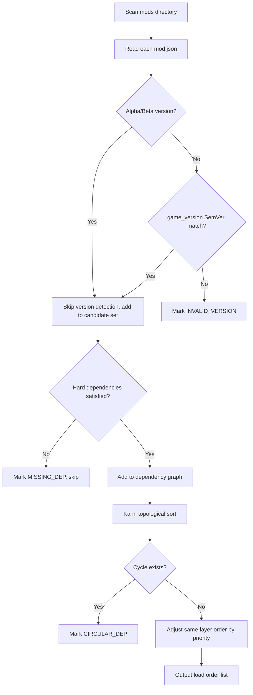

#### 4.4.3 Version Constraint Syntax

SemVer constraints are used:

| Expression | Meaning |
|--------|------|
| `1.2.3` | Exact version |
| `>=1.0.0` | Greater than or equal |
| `>=1.0.0,<2.0.0` | Range |
| `^1.2.3` | Compatible with 1.x.x, and >=1.2.3 |
| `~1.2.3` | Compatible with 1.2.x, and >=1.2.3 |
| `*` | Any version |

---

## 5. Loading Flow Design

### 5.1 Mod Scanning and Verification Flow at Startup

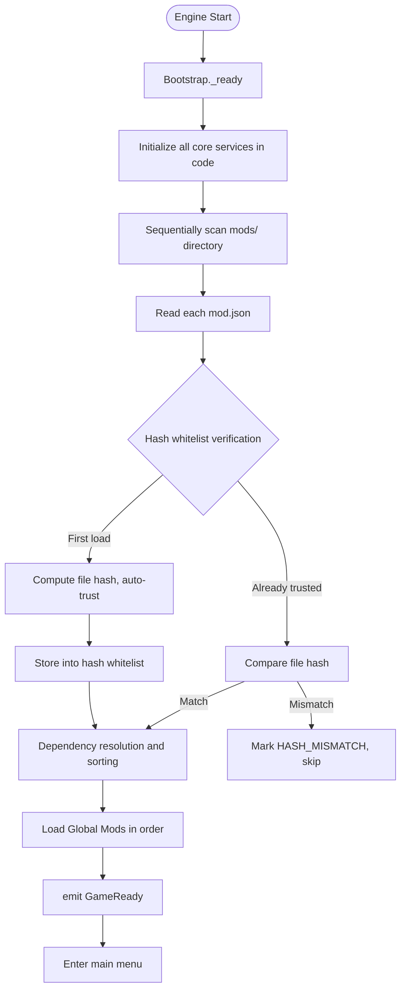

> **Sequential Scanning**: This design uses fully sequential scanning, without parallelism/multi-threading. The scanning phase is I/O-intensive; parallelization has limited benefit and introduces thread safety issues. See §10.1.1 for details.

**Scanning Pseudocode**:

```gdscript
# core/loader/ModLoaderCore.gd
func scan_global_mods() -> Array[ModDescriptor]:
	var dir := DirAccess.open(Bootstrap.get_global_mods_dir())
	var descs: Array[ModDescriptor] = []
	dir.list_dir_begin()
	var name := dir.get_next()
	while name != "":
		if dir.dir_exists(name):
			var meta_path := "%s/%s/mod.json" % [Bootstrap.get_global_mods_dir(), name]
			if FileAccess.file_exists(meta_path):
				var desc := ModDescriptor.from_file(meta_path)
				if desc.valid:
					var mod_dir := "%s/%s" % [Bootstrap.get_global_mods_dir(), name]
					if _hash_verifier.verify(name, mod_dir):
						descs.append(desc)
					else:
						_logger.error("ModLoader", "Hash verification failed: %s" % name)
				else:
					_logger.error("ModLoader", "Invalid mod.json: %s" % meta_path)
		name = dir.get_next()
	dir.list_dir_end()
	return descs
```

### 5.2 Global Mods Loading Order and Initialization Flow

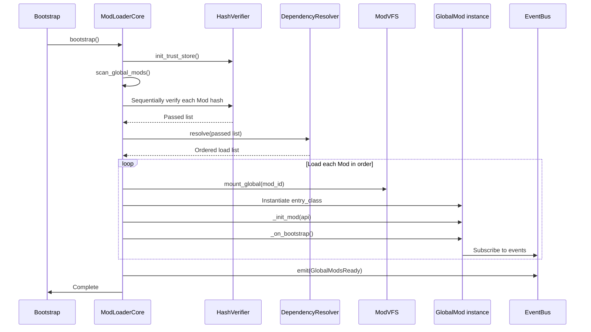

> **Note**: If a Mod throws an error during instantiation or `_on_bootstrap()` in the loading process, the loading flow is interrupted, an error is logged, and the game may crash. No exception isolation is performed. See §8.3 for details.

**Global Mod Initialization Callback Order**:

1. `_init_mod(api)` —— Inject API reference
2. `_on_bootstrap()` —— Register resources, blocks, recipes, etc.
3. `_on_post_bootstrap()` —— Triggered after all Global Mods' `_on_bootstrap` complete; can reference other Mods' registered content here
4. `_on_world_load(world_id)` / `_on_world_unload(world_id)` —— Callbacks on world switch (Global Mods can also listen)
5. `_on_shutdown()` —— Callback on process exit

### 5.3 World Mods Loading/Unloading Flow on World Switch

See §2.5 sequence diagram. This section supplements the state machine definition.

#### 5.3.1 State Machine Definition

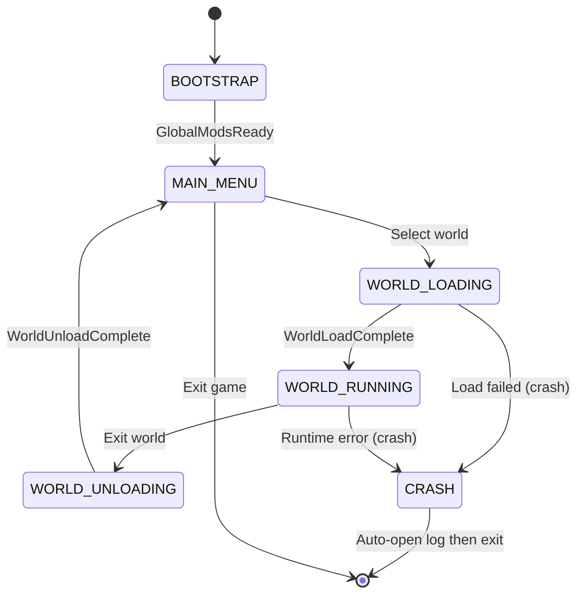

> **Note**: Load failure no longer rolls back to the main menu. Mod errors will cause a crash, and the log is automatically opened on crash. See §8.3 for details.

#### 5.3.2 World Mod Initialization Callback Order

1. `_init_mod(api)`
2. `_on_world_load(world_id)` —— Register world-specific content
3. `_on_world_enter(world_id)` —— Triggered after the player formally enters the world (player entity has been spawned)
4. `_on_world_leave(world_id)` —— Triggered before the player leaves (can save data)
5. `_on_world_unload(world_id)` —— Unload cleanup

### 5.4 Data Hot Reload (Data Only; Code Changes Require Restart)

In development environment, **Global Mod data hot reload** is supported — only JSON config, resource override declarations, and registry data items are reloaded; **the `.gd` script itself is not reloaded**. Code changes require a game restart.

```gdscript
# Via console command
ModAPI.dev.reload_mod_data("atom_core_blocks")
```

Hot reload flow:

1. Trigger `ModReloadStart` event.
2. Re-read the Mod's JSON config files under `config/`.
3. Re-parse the `resource_overrides` declaration in `mod.json` and update the ModVFS override mapping table.
4. Call the Mod's `_on_data_reloaded()` callback to notify it to reapply config.
5. Trigger `ModReloadComplete` event.

```gdscript
# Optional callback implemented in Mod
func _on_data_reloaded() -> void:
	var cfg := _api.persistence.load_config("settings", {})
	_apply_settings(cfg)
```

> **Limitations**:
> - `.gd` script resources are not reloaded. The Godot runtime does not support reliable script hot replacement.
> - The Mod main class is not re-instantiated. The instance remains unchanged; only its data is refreshed.
> - Code logic changes require a game restart to take effect.
> - Only enabled when `OS.is_debug_build()` is true; disabled in production.

---

## 6. API Design

### 6.1 Core API Interface Definition

`ModAPI` is the unified facade for Mods, aggregating all core services. Mods receive a `ModAPI` instance in `_init_mod(api)`.

```gdscript
# core/api/ModAPI.gd
class_name ModAPI
extends RefCounted

var logger: LoggerAPI
var events: EventAPI
var resources: ResourceAPI
var registry: RegistryAPI
var persistence: PersistenceAPI
var vfs: VFSAPI
var world: WorldAPI
var dev: DevAPI

func _init(mod_descriptor: ModDescriptor) -> void:
	pass
```

> **Note**: This design **does not include** `PermissionAPI`. No permission control. See §9 for details.

#### 6.1.1 Sub-API Interfaces

```gdscript
# Log API
class_name LoggerAPI
extends RefCounted
func trace(tag: String, msg: String) -> void
func debug(tag: String, msg: String) -> void
func info(tag: String, msg: String) -> void
func warn(tag: String, msg: String) -> void
func error(tag: String, msg: String) -> void
func fatal(tag: String, msg: String) -> void
```

```gdscript
# Event API
class_name EventAPI
extends RefCounted

# General events (low frequency)
func subscribe(event_name: String, callable: Callable, priority: int = 0) -> EventSubscription
func unsubscribe(subscription: EventSubscription) -> void
func emit(event_name: String, payload: Dictionary = {}) -> void
func emit_deferred(event_name: String, payload: Dictionary = {}) -> void

# ★ Dedicated fast channel for high-frequency events (tick / physics_tick)
func subscribe_tick(callable: Callable) -> void
func unsubscribe_tick(callable: Callable) -> void
func subscribe_physics_tick(callable: Callable) -> void
func unsubscribe_physics_tick(callable: Callable) -> void
```

```gdscript
# Resource API (based on mod:// protocol)
class_name ResourceAPI
extends RefCounted
func load(mod_id: String, relative_path: String) -> Resource
func load_threaded(mod_id: String, relative_path: String) -> void
func exists(mod_id: String, relative_path: String) -> bool
```

```gdscript
# Registry API
class_name RegistryAPI
extends RefCounted
func register_block(id: String, script: Script) -> void
func register_item(id: String, script: Script) -> void
func register_entity(id: String, script: Script) -> void
func register_recipe(id: String, recipe: Dictionary) -> void
func get_block(id: String) -> Script
func list_blocks(prefix: String = "") -> Array[String]
```

```gdscript
# Persistence API
class_name PersistenceAPI
extends RefCounted
func save_config(key: String, data: Variant) -> void
func load_config(key: String, default: Variant = null) -> Variant
func save_data(key: String, data: Variant) -> void
func load_data(key: String, default: Variant = null) -> Variant
```

```gdscript
# World API
class_name WorldAPI
extends RefCounted
func get_current_world_id() -> String
func is_world_loaded() -> bool
func get_world_seed() -> int
```

### 6.2 Event System Design

#### 6.2.1 Event Definition

Events use a "name + dictionary payload" model to avoid strong type coupling:

```gdscript
# core/event/events/GameEvents.gd
class_name GameEvents

# Lifecycle events
const BOOTSTRAP_START := "core:bootstrap_start"
const GLOBAL_MODS_READY := "core:global_mods_ready"
const WORLD_LOAD_START := "core:world_load_start"
const WORLD_LOAD_COMPLETE := "core:world_load_complete"
const WORLD_UNLOAD_START := "core:world_unload_start"
const WORLD_UNLOAD_COMPLETE := "core:world_unload_complete"

# Game loop events (high frequency, use dedicated fast channel, do not go through general EventBus)
const TICK := "core:tick"
const PHYSICS_TICK := "core:physics_tick"

# Player events
const PLAYER_JOIN := "core:player_join"
const PLAYER_LEAVE := "core:player_leave"
```

#### 6.2.2 Dedicated Fast Channel for High-Frequency Events

`core:tick` and `core:physics_tick` are high-frequency events triggered every frame. To avoid the GC pressure from general EventBus's Dictionary payloads, these two events use a **dedicated fast channel**:

- **Pre-allocated payload**: EventBus internally pre-allocates a single `_tick_payload` and `_physics_tick_payload` Dictionary; each frame `clear()` then fills in `delta` / `tick`, reused, zero allocation.
- **Dedicated subscriber arrays**: `_tick_subscribers: Array[Callable]` and `_physics_tick_subscribers: Array[Callable]`, directly iterated and called, with no Dictionary lookup and no priority sorting overhead.
- **Bypass general dispatch**: tick dispatch does not go through the general `emit()` path; handled by the dedicated method `EventBus._dispatch_tick(delta, tick)`.
- **Deferred modification queue**: If a Mod calls `subscribe_tick()` / `unsubscribe_tick()` within a tick callback (e.g., the "unsubscribe after processing one frame" pattern), the modification request does not take effect immediately, but is added to a deferred queue and applied uniformly after the current frame's dispatch completes. This avoids modifying the array during iteration, which would cause skipping elements or crashes.

```gdscript
# core/event/EventBus.gd
var _tick_payload: Dictionary = {}
var _tick_subscribers: Array[Callable] = []
var _pending_tick_adds: Array[Callable] = []     # Deferred subscribe queue
var _pending_tick_rems: Array[Callable] = []     # Deferred unsubscribe queue
var _is_dispatching_tick: bool = false

func subscribe_tick(callable: Callable) -> void:
	if _is_dispatching_tick:
		_pending_tick_adds.append(callable)  # Dispatching: defer
	else:
		_tick_subscribers.append(callable)

func unsubscribe_tick(callable: Callable) -> void:
	if _is_dispatching_tick:
		_pending_tick_rems.append(callable)  # Dispatching: defer
	else:
		_tick_subscribers.erase(callable)

func _dispatch_tick(delta: float, tick: int) -> void:
	_tick_payload.clear()
	_tick_payload["delta"] = delta
	_tick_payload["tick"] = tick
	_is_dispatching_tick = true
	var snapshot := _tick_subscribers.duplicate()  # Iterate snapshot; modifications to original array don't affect iteration
	for cb in snapshot:
		cb.call(_tick_payload)
	_is_dispatching_tick = false
	_flush_pending_tick_changes()  # Apply deferred modifications after dispatch completes

func _flush_pending_tick_changes() -> void:
	for cb in _pending_tick_rems:
		_tick_subscribers.erase(cb)
	_pending_tick_rems.clear()
	for cb in _pending_tick_adds:
		_tick_subscribers.append(cb)
	_pending_tick_adds.clear()
```

**Usage in Mod**:

```gdscript
func _on_bootstrap() -> void:
	_api.events.subscribe_tick(_on_tick)
	_api.events.subscribe(GameEvents.WORLD_LOAD_COMPLETE, _on_world_loaded)

func _on_tick(payload: Dictionary) -> void:
	var delta: float = payload.get("delta", 0.0)
	# Logic processing
```

#### 6.2.3 General Event Subscribe/Emit Example

```gdscript
# In a Mod (low-frequency event)
func _on_bootstrap() -> void:
	_api.events.subscribe(GameEvents.WORLD_LOAD_COMPLETE, _on_world_loaded)

func _on_world_loaded(payload: Dictionary) -> void:
	var world_id: String = payload.get("world_id", "")
	_api.logger.info("my_mod", "World loaded: %s" % world_id)
```

Events support **priority** (lower number executes first) and **stop propagation**:

```gdscript
func _on_tick(payload: Dictionary) -> void:
	_api.events.stop_propagation()
```

#### 6.2.4 Event Dispatch Mechanism

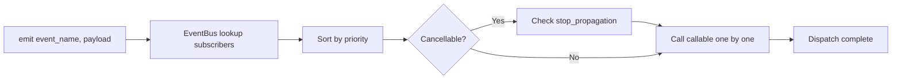

> **Note**: `core:tick` / `core:physics_tick` do not go through this general path; they use the dedicated fast channel in §6.2.2.

#### 6.2.5 Event Scope

| Event Source | Scope | Receivers |
|---------|--------|--------|
| `core:*` lifecycle events | Global | All loaded Mods |
| `core:tick` / `core:physics_tick` | Current world only | Global Mods + current world World Mods |
| `<mod_id>:*` custom events | Global by default; emitted by World Mods auto-scoped to their world | Depends on subscriber scope |

When a World Mod is unloaded, EventBus automatically removes all its subscriptions (based on the mod_id registry), avoiding dangling callbacks.

#### 6.2.6 Subscriber Count Monitoring

EventBus maintains a subscriber count for each event name. When the number of subscribers exceeds a threshold (default 256), a WARN log is recorded and prominently displayed in the debug overlay:

```gdscript
const MAX_SUBSCRIBERS_PER_EVENT := 256

func subscribe(event_name: String, callable: Callable, priority: int = 0) -> EventSubscription:
	var subs := _subscribers.get(event_name, []) as Array
	if subs.size() >= MAX_SUBSCRIBERS_PER_EVENT:
		_logger.warn("EventBus", "Event %s subscriber count exceeds threshold %d" % [event_name, MAX_SUBSCRIBERS_PER_EVENT])
	# ... registration logic
```

> The debug overlay (§8.2.2) displays the subscriber count of each event in real time and prominently alerts on abnormal growth. This is a monitoring alert mechanism, not a forced subscription block.

---

## 7. Persistence Scheme

### 7.1 Config Data Storage Format

All config and data use **JSON** format (human-readable, easy to debug); binary large objects use separate `.bin` files indexed via JSON.

#### 7.1.1 Global Mod Config Storage

Location: `mods/<mod_id>/config/<key>.json`

```json
{
	"mod_id": "atom_core_blocks",
	"mod_version": "1.0.0",
	"created_at": "2026-06-29T10:00:00Z",
	"updated_at": "2026-06-29T12:30:00Z",
	"data": {
		"max_stack_size": 64,
		"enable_physics": true,
		"block_hardness": {
			"stone": 1.5,
			"dirt": 0.5
		}
	}
}
```

#### 7.1.2 World Mod Config Storage

Location: `saves/<WorldName>/mods/<mod_id>/config/<key>.json`

```json
{
	"mod_id": "adventure_quest_pack",
	"mod_version": "1.2.0",
	"world_id": "WorldName1",
	"world_seed": 123456789,
	"created_at": "2026-06-29T10:00:00Z",
	"updated_at": "2026-06-29T12:30:00Z",
	"data": {
		"difficulty": "hard",
		"active_quests": ["main_quest_1", "side_quest_3"],
		"completed_quests": []
	}
}
```

### 7.2 Data Save and Load

#### 7.2.1 PersistenceService Interface

```gdscript
# core/persistence/PersistenceService.gd
class_name PersistenceService
extends RefCounted

# Global Mod config
func save_global_config(mod_id: String, key: String, data: Variant) -> void
func load_global_config(mod_id: String, key: String, default: Variant = null) -> Variant

# Global Mod runtime data
func save_global_data(mod_id: String, key: String, data: Variant) -> void
func load_global_data(mod_id: String, key: String, default: Variant = null) -> Variant

# World Mod config
func save_world_config(world_id: String, mod_id: String, key: String, data: Variant) -> void
func load_world_config(world_id: String, mod_id: String, key: String, default: Variant = null) -> Variant

# World Mod runtime data
func save_world_data(world_id: String, mod_id: String, key: String, data: Variant) -> void
func load_world_data(world_id: String, mod_id: String, key: String, default: Variant = null) -> Variant
```

#### 7.2.2 Access via ModAPI (auto-injects mod_id and world_id context)

```gdscript
# In a Global Mod
_api.persistence.save_config("settings", {"max_stack": 64})
var cfg = _api.persistence.load_config("settings", {})

# In a World Mod (world_id auto-obtained from current world context)
_api.persistence.save_data("quest_progress", {"quest_1": "stage_3"})
```

#### 7.2.3 Write Flow

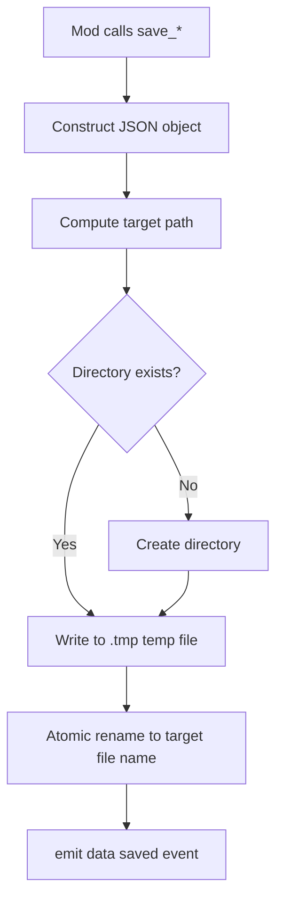

> **Atomic Write**: First write to `<key>.json.tmp`, then `rename` to `<key>.json`, to avoid half-written files caused by crashes.

#### 7.2.4 Save Timing

| Trigger Point | Saved Content | Corresponding Phase |
|--------|---------|---------|
| Mod actively calls `save_*` | Immediate save | Runtime |
| World unload · Phase 1 (after `WorldUnloadStart`, after `_on_world_leave()` is called) | Auto-save all World Mods' `data/` | ★ Two-phase Unload · Full save phase (see §2.5) |
| Before game exit (`_on_shutdown`) | Auto-save all Global Mods' `data/` | Shutdown |
| Auto-save timer (default 5 minutes) | Save all Mods' `data/` | Runtime |

> **Constraints on Save Timing from Two-phase Unload**: World Mod auto-save occurs in **Phase 1 (Full Save)**, when all `_on_world_leave()` callbacks have completed and memory state is intact, so the saved data is valid. **No save operations are performed in Phase 2** (`_on_world_unload()` and beyond); only memory cleanup and VRAM release. This ensures that even if Phase 2 crashes, the save data has been fully persisted in Phase 1. Mod developers should organize runtime temporary state into the `data` dictionary in `_on_world_leave()`, rather than relying on `_on_world_unload()`.

### 7.3 Explicitly Unresolved Issues

**Data Migration**: This design **does not provide** a data migration mechanism. When a Mod version upgrade causes storage format changes, old version data may not load correctly. Mod developers need to handle compatibility themselves at `load_*` time (e.g., fall back via the `default` parameter).

**Save Data Format Versioning**: This design **does not provide** a save schema versioning mechanism. JSON files do not contain a `_meta.schema_version` field, and no cross-version format compatibility is performed. If data formats are incompatible after a Mod upgrade, the Mod handles it itself or accepts data loss.

> **Recommendation**: Mod developers maintain their own version fields in `data` and implement their own migration logic (e.g., read `data._version`; if outdated, reset to default). The core does not participate in this process.

---

## 8. Debug and Log System

### 8.1 Log Levels and Output Specification

#### 8.1.1 Log Levels

| Level | Value | Use |
|------|------|------|
| `TRACE` | 0 | Extremely fine-grained tracing (per-frame, per-chunk) |
| `DEBUG` | 1 | Debug info (state changes, load steps) |
| `INFO` | 2 | General info (Mod load complete, world switch) |
| `WARN` | 3 | Warning (missing dependency but degradeable, subscriber exceeds threshold) |
| `ERROR` | 4 | Error (Mod load failure, hash mismatch) |
| `FATAL` | 5 | Fatal error (core crash, cannot continue running) |

#### 8.1.2 Log Format

```
[2026-06-29 12:34:56.789] [INFO ] [atom_core_blocks] Initialization start
[2026-06-29 12:34:56.790] [DEBUG] [ModLoaderCore] Loading Mod: atom_core_blocks v1.0.0
[2026-06-29 12:34:57.001] [WARN ] [atom_ui_framework] Font fallback to default: sans
[2026-06-29 12:34:57.500] [ERROR] [adventure_quest_pack] Hash mismatch, skip loading
```

Field order: `[Timestamp] [Level] [Source Tag] Message`

#### 8.1.3 Output Targets

| Target | Enable Condition | Path |
|------|---------|------|
| Editor Output | `OS.is_debug_build()` | Godot Output panel |
| Console stdout | Always | Standard output |
| Log file | Always | `<writable root>/logs/atomzero.log` |
| Rolling archive | File exceeds 10MB | `atomzero.log.1`, `atomzero.log.2` (keep 5 copies) |

### 8.2 Mod Debug Tool Integration Scheme

#### 8.2.1 Console Commands

In the development environment, press `/` to open the built-in console, supporting the following commands:

| Command | Description |
|------|------|
| `mods list` | List all loaded Mods and their status |
| `mods info <mod_id>` | Show detailed info for the specified Mod |
| `mods reload <mod_id>` | Data hot reload the specified Global Mod (data only, no code reload) |
| `mods enable <mod_id>` | Enable the specified Mod |
| `mods disable <mod_id>` | Disable the specified Mod |
| `events list` | List all current event subscribers and counts |
| `events emit <event_name> [json]` | Manually trigger an event |
| `registry list blocks` | List all registered blocks |
| `hash list` | List Mods and hashes in the hash whitelist |
| `hash reset <mod_id>` | Reset hash trust for the specified Mod |
| `log level <level>` | Set the global log level |

#### 8.2.2 Debug Overlay

In the development environment, a HUD overlay is displayed, showing in real time:

- Number of loaded Mods and number of failures
- Current FPS, chunk load count, memory usage
- Current world ID and state machine state
- Subscriber count for each event (red alert when exceeding threshold)
- Most recent 10 WARN/ERROR logs

#### 8.2.3 Mod-built Debug Panels

Mods can register custom debug panels via `ModAPI.dev.register_debug_panel(panel_scene)`, automatically integrated into the built-in debug window.

### 8.3 Error Handling and Crash Mechanism

#### 8.3.1 Design Stance: No Exception Isolation

Godot 4's GDScript **has no native try/catch mechanism**. This design **explicitly abandons** runtime exception isolation, adopting the following strategies:

1. **Mod load failure**: Record ERROR log, skip the Mod, aggregate into an error report interface for user review. Errors during the load phase (scanning, dependency resolution, before instantiation) can be captured and skipped.
2. **Mod runtime error**: Errors thrown in Mod callbacks (`_on_bootstrap`, `_on_tick`, `_on_world_load`, etc.) are **not captured**. The error propagates up the call stack and may cause the game to crash.
3. **Auto-open log on crash**: When the game crashes (process exits abnormally), Logger automatically opens the log file (calling `OS.shell_open()` to open `<writable root>/logs/atomzero.log`), convenient for users and developers to troubleshoot.

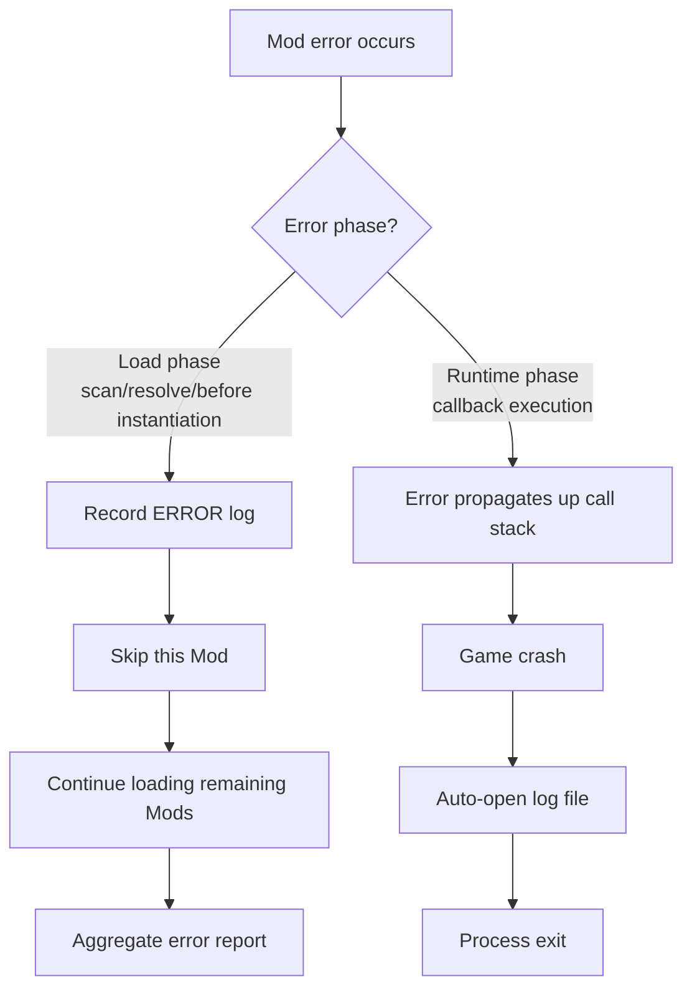

#### 8.3.2 Load Phase Error Handling

Errors in the load phase (before Mod instantiation) can be detected and skipped:

| Error Category | Handling |
|---------|---------|
| Invalid metadata (`mod.json` missing fields/format error) | Record ERROR, skip this Mod |
| Hash verification failed | Record ERROR, skip this Mod |
| Missing dependency | Record WARN, skip Mods depending on it |
| Circular dependency | Record ERROR, skip all Mods in the cycle |
| game_version mismatch (release version) | Record ERROR, skip this Mod |

All load phase errors are aggregated into the error report interface; users can choose "Continue" or "Exit".

#### 8.3.3 Runtime Errors and Crashes

After Mod instantiation (after `_init_mod` is called), errors in all Mod callbacks are **not captured**:

- Errors in `_on_bootstrap()` → may cause startup failure → crash
- Errors in `_on_tick()` → may cause frame loop interruption → crash
- Errors in `_on_world_load()` → may cause world load interruption → crash

When a crash occurs:

1. Logger's `_notification(NOTIFICATION_PREDELETE)` or `get_tree().tree_exiting` signal is triggered.
2. Call `OS.shell_open("file://" + Bootstrap.get_logs_dir() + "atomzero.log")` to open the log.
3. Process exits.

```gdscript
# core/logging/Logger.gd
func _on_tree_exiting() -> void:
	_flush_to_disk()
	if _crash_detected:
		var log_path := Bootstrap.get_logs_dir() + "atomzero.log"
		OS.shell_open("file://" + log_path)
```

#### 8.3.4 Crash Report

On game crash, a crash report `<writable root>/logs/crash_<timestamp>.txt` is automatically generated, containing:

- Game version, engine version, platform
- Loaded Mod list and versions
- Most recent 100 log entries
- System info (CPU, memory, GPU)

---

## 9. Security Mechanism

### 9.1 Design Stance

This design **explicitly does not implement** the following security features:

- **Permission control system**: No Mod permission declaration, review, or verification mechanism is provided. All Mods have the same API access capabilities.
- **Code signing**: Ed25519 or any asymmetric signature algorithm is not used to sign and verify Mods.
- **Security sandbox**: No process-level or language-level sandbox isolation is provided. GDScript's dynamic nature makes a sandbox infeasible in Godot.

This design **only provides** hash whitelist integrity verification (TOFU model), used to detect accidental corruption and tampering of Mod files.

> **Threat Model**: This mechanism targets "accidental Mod file corruption" and "non-technical users mistakenly installing tampered Mods"; it does not target "attackers with local file system access". The latter already has local execution permission, and any pure software-level protection is meaningless.

### 9.2 Hash Whitelist Verification (TOFU Model)

#### 9.2.1 TOFU Mechanism

The **Trust On First Use** model is adopted:

1. **First load**: Compute the SHA256 hash of all Mod files, **auto-trust** and store into the whitelist (no confirmation dialog).
2. **Subsequent loads**: Recompute the file hash and compare with the whitelist record.
   - Match → allow loading.
   - Mismatch → mark `HASH_MISMATCH`, record ERROR, refuse to load, prompt the user that the file has been modified.

> **No trust confirmation dialog implemented**: This design simplifies the first-use flow, without popping up a "Do you trust this Mod?" confirmation dialog. On first load, the hash is written directly to the whitelist, avoiding blocking Bootstrap and adding UI dependencies. If you need to recompute the hash, use the console command `hash reset <mod_id>` (see §8.4).

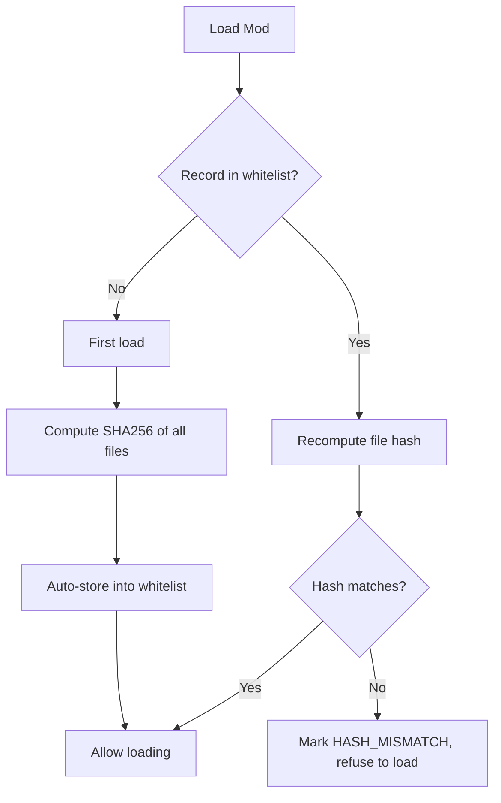

#### 9.2.2 Whitelist Storage

The whitelist is stored in `<writable root>/hash_whitelist.json`:

```json
{
	"mods": {
		"atom_core_blocks": {
			"version": "1.0.0",
			"files_hash": "SHA256_OF_ALL_FILES_COMBINED",
			"trusted_at": "2026-06-29T10:00:00Z",
			"file_count": 42
		},
		"atom_ui_framework": {
			"version": "1.1.0",
			"files_hash": "SHA256_OF_ALL_FILES_COMBINED",
			"trusted_at": "2026-06-29T10:05:00Z",
			"file_count": 18
		}
	}
}
```

> **Known Limitation**: `hash_whitelist.json` itself is a plain JSON file that can be edited by local attackers. This design accepts this limitation (see §9.1 Threat Model).

#### 9.2.3 Hash Computation (Metadata Files + Declarative Resource Manifest + Streaming Hash)

Hash computation adopts a **layered strategy** to avoid memory spikes from reading large binary files (`.png`, `.wav`, etc.) in full:

1. **Metadata files** (`.gd`, `.json`, `.tres`, `.tscn`, `manifest.json`): SHA256 is computed at runtime by HashVerifier, using **streaming chunked reading** (64KB chunks), with constant memory usage.
2. **Binary resource files** (`.png`, `.wav`, `.ogg`, `.ttf`, etc.): Hashes are not computed individually. The Mod packaging tool (§4.3.3) generates a `manifest.json` declarative manifest, recording each binary file's `size` + `sha256`. HashVerifier **only verifies the hash of `manifest.json` itself**, and verifies each binary file's `size` matches the manifest (fast stat check, no file content read).

**`manifest.json` format** (auto-generated by the packaging tool, see §4.3.3):

```json
{
	"mod_id": "atom_core_blocks",
	"mod_version": "1.0.0",
	"generated_at": "2026-06-29T10:00:00Z",
	"binary_files": {
		"assets/textures/stone_diffuse.png": { "size": 1048576, "sha256": "abc123..." },
		"assets/textures/dirt_diffuse.png": { "size": 524288, "sha256": "def456..." },
		"assets/sounds/break.ogg": { "size": 32768, "sha256": "ghi789..." }
	}
}
```

> In **Development Mode**, there is no `manifest.json` (loose files, Godot auto-imports). In this case, HashVerifier only computes hashes for metadata files, skipping binary file verification. Development mode trusts the editor environment and does not enforce integrity verification.

```gdscript
# core/security/HashVerifier.gd
const CHUNK_SIZE := 65536  # 64KB streaming read chunk size
const METADATA_EXTS := [".gd", ".json", ".tres", ".tscn"]

func compute_mod_hash(mod_dir: String) -> String:
	var ctx := HashingContext.new()
	ctx.start(HashingContext.HASH_SHA256)
	_hash_metadata_files(ctx, mod_dir)          # Metadata files: streaming hash
	_verify_binary_files(ctx, mod_dir)           # Binary files: verify manifest + size
	return ctx.finish().hex_encode()

func _hash_metadata_files(ctx: HashingContext, dir_path: String) -> void:
	var dir := DirAccess.open(dir_path)
	dir.list_dir_begin()
	var name := dir.get_next()
	while name != "":
		if dir.current_is_dir() and name != "." and name != ".." and name != ".godot":
			_hash_metadata_files(ctx, dir_path + "/" + name)
		elif not dir.current_is_dir():
			if _is_metadata_file(name):
				_hash_file_streaming(ctx, dir_path + "/" + name)
		name = dir.get_next()
	dir.list_dir_end()

func _hash_file_streaming(ctx: HashingContext, file_path: String) -> void:
	# ★ Streaming chunked read, memory usage constant at 64KB, independent of file size
	var file := FileAccess.open(file_path, FileAccess.READ)
	if file == null:
		return
	while file.get_position() < file.get_length():
		var remaining := file.get_length() - file.get_position()
		var chunk_size := min(CHUNK_SIZE, remaining)
		ctx.update(file.get_buffer(chunk_size))
	file.close()

func _verify_binary_files(ctx: HashingContext, mod_dir: String) -> void:
	var manifest_path := mod_dir + "/manifest.json"
	if not FileAccess.file_exists(manifest_path):
		return  # Development mode has no manifest, skip
	var manifest: Dictionary = JSON.parse_string(FileAccess.get_file_as_string(manifest_path))
	var binary_files: Dictionary = manifest.get("binary_files", {})
	for rel_path in binary_files:
		var abs_path := mod_dir + "/" + rel_path
		var expected_size: int = binary_files[rel_path]["size"]
		if not FileAccess.file_exists(abs_path):
			ctx.update(("MISSING:" + rel_path).to_utf8_buffer())
			continue
		# size verification (stat only, no file content read)
		var f := FileAccess.open(abs_path, FileAccess.READ)
		var actual_size := f.get_length()
		f.close()
		if actual_size != expected_size:
			ctx.update(("SIZE_MISMATCH:" + rel_path).to_utf8_buffer())
		else:
			ctx.update(("OK:" + rel_path + ":" + str(expected_size)).to_utf8_buffer())

func _is_metadata_file(name: String) -> bool:
	for ext in METADATA_EXTS:
		if name.ends_with(ext):
			return true
	return false
```

> **Design Highlights**:
> - Metadata files (code and config) are the core of Mod behavior; runtime streaming hash ensures integrity.
> - Binary resources declare size + sha256 via `manifest.json`; at runtime only size is verified (O(1) stat call, no file content read), avoiding memory spikes and startup latency from full hashing of large files.
> - `manifest.json` itself participates in hash computation as a metadata file; tampering with the manifest will be detected.
> - Streaming chunked reading (64KB chunks) ensures constant memory usage; the hash memory overhead of a 50MB texture and a 1KB script is identical.

#### 9.2.4 Verification Interface

```gdscript
# core/security/HashVerifier.gd
class_name HashVerifier
extends RefCounted

func verify(mod_id: String, mod_dir: String) -> bool:
	var current_hash := compute_mod_hash(mod_dir)  # Full streaming hash, constant 64KB memory (see §9.2.3)
	var stored_hash := _whitelist.get(mod_id, {}).get("files_hash", "")
	if stored_hash.is_empty():
		return _first_use_prompt(mod_id, current_hash)
	if current_hash != stored_hash:
		_logger.error("HashVerifier", "Mod %s hash mismatch, refuse to load" % mod_id)
		return false
	return true

func reset_trust(mod_id: String) -> void:
	_whitelist.erase(mod_id)
	_save_whitelist()
```

---

## 10. Performance Optimization Strategy

### 10.1 Mod Loading Performance Optimization

#### 10.1.1 Sequential Scanning (No Parallelism)

This design uses **fully sequential scanning**, without `WorkerThreadPool` parallelization. Reasons:

- The scanning phase is I/O-intensive (file reading + directory traversal); disk I/O is inherently serialized, and parallelization has limited benefit.
- Sequential scanning avoids thread-safety boundary issues of `DirAccess`, `FileAccess`, `ResourceLoader`.
- Sequential scanning of 50 Mods typically takes < 500ms, which is acceptable.

```gdscript
# Sequential scan, no parallelism
for desc in all_descriptors:
	if _hash_verifier.verify(desc.mod_id, desc.mod_dir):
		valid_descs.append(desc)
```

#### 10.1.2 Resource Lazy Loading

- The registry only registers scripts and metadata, without preloading textures/models.
- Textures are loaded on first block access (`ResourceLoader.load_threaded_request`).
- ModVFS maintains an LRU cache, automatically releasing low-frequency resources when the threshold is exceeded.

#### 10.1.3 Caching Load Results (Dependency Resolution Only, No Hash Skip)

Cache **dependency resolution results** and **load order index** to `<writable root>/.cache/mod_cache.json`:

```json
{
	"atom_core_blocks": {
		"version": "1.0.0",
		"load_order_index": 0,
		"resolved_deps": ["atom_core_base"],
		"cached_at": "2026-06-29T10:00:00Z"
	}
}
```

On the next startup, if `mod.json`'s `version` and `dependencies` fields are unchanged, dependency resolution and topological sort are skipped, and `load_order_index` is reused directly.

> **Key Limitation: Hash Verification Cannot Be Short-Circuited by Cache (Circular Dependency)**
>
> Intuitively, one would want to record `files_hash` in the cache, and on the next startup, if the hash is unchanged, skip hash computation. But this constitutes a **circular dependency**: to determine "hash unchanged", you must first compute the current file's hash and compare it with the cached value — and computing the current hash is the overhead you wanted to skip. Therefore hash verification **cannot be short-circuited by cache**; every startup must recompute in full (see §10.1.5).
>
> Caching only applies to dependency resolution and load order, because these depend only on the static fields of `mod.json` (`version`, `dependencies`), and can be invalidated by an O(1) read of `mod.json` for comparison, without a full scan.
>
> This design has **removed** the `files_hash` field from the cache, to avoid misleading readers into thinking hash verification can be skipped.

#### 10.1.4 Phased Loading

Startup loading is split into multiple phases, with a frame rendered between each phase to avoid long stalls:


Each instantiation batch does not exceed N Mods (configurable, default 10); the rest are deferred to the next frame.

#### 10.1.5 Hash Verification Performance (Accept Full Recomputation + Full Streaming Hash)

**This design explicitly accepts the overhead of full hash recomputation on every startup**, without implementing mtime pre-filtering, incremental hashing, archive single-hash optimizations, and **imposes no size limit on Mod resources**. Reasons:

- §10.1.3 has explained that hash verification cannot be short-circuited by cache (circular dependency); any "skip" strategy requires first computing the hash to verify invalidation, which is equivalent to no skip.
- §9.2.3's full streaming hash strategy fundamentally solves the memory pressure problem: metadata files use 64KB chunked streaming reads, with **memory usage constant at 64KB, independent of file size** — whether a 1KB script or a 500MB texture, the hash memory overhead is identical. Therefore, no size limit is needed to avoid memory spikes.
- Binary resource files use O(1) stat verification via `manifest.json`'s size declaration, without reading file content; the verification overhead of a single large file is negligible.
- Startup time is linearly related to the total byte count of metadata files (estimated by disk read rate); for typical Mods (metadata totaling tens of MB), full recomputation takes seconds, which is acceptable. For ultra-large Mods, the startup time is determined by their own resource scale, which is within the Mod author's control, and is not forcibly limited by the engine side.

**Design Intent of No Size Limit**:

- Streaming hash ensures memory safety (constant 64KB); size limits have no memory safety necessity.
- A size cap would artificially fragment Mod functional boundaries, forcing authors to split logically-complete Mods into multiple sub-Mods to evade the limit, increasing dependency management complexity.
- Startup time is a trade-off for Mod authors and users; Mod authors should optimize their own resources (e.g., compress textures, trim unused resources), rather than the engine side refusing to load in a one-size-fits-all manner.

```gdscript
# core/security/HashVerifier.gd
# ★ No size limit constants; verify() directly enters full streaming hash

func verify(mod_id: String, mod_dir: String) -> bool:
	var current_hash := compute_mod_hash(mod_dir)  # Full streaming hash, constant 64KB memory
	var stored_hash := _whitelist.get(mod_id, {}).get("files_hash", "")
	if stored_hash.is_empty():
		return _first_use_prompt(mod_id, current_hash)
	if current_hash != stored_hash:
		_logger.error("HashVerifier", "Mod %s hash mismatch, refuse to load" % mod_id)
		return false
	return true
```

> **Relationship with §9.2.4**: This section is the performance explanation of §9.2.4's `verify()` interface; the two implementations are consistent. The streaming chunked implementation of `compute_mod_hash()` is in §9.2.3.

#### 10.1.6 World Mods Loading Optimization

- World Mods loading pre-warms resources on a background thread (`load_threaded_get`).
- The main thread only does registry writes and event subscriptions, avoiding blocking rendering.
- Loading progress is reported in real time via the `WorldLoadProgress` event; the UI shows a progress bar.

#### 10.1.7 Event Dispatch Optimization

- **High-frequency events** (`tick`, `physics_tick`) use the dedicated fast channel in §6.2.2, with pre-allocated payload reuse and zero Dictionary allocation.
- **General events**: EventBus maintains a subscriber array per event name, pre-sorted by priority, avoiding re-sorting on every emit.
- Stop propagation is implemented via early break, O(1) short-circuit.

#### 10.1.8 Registry Query Optimization

- The registry uses `Dictionary` with string IDs as keys directly, O(1) lookup.
- `list_blocks(prefix)` iterates Dictionary keys filtered by `string.begins_with()`. For <10k entries, <1ms; no trie optimization.

---

## Appendix A: Minimal Mod Development Example

### A.1 Global Mod Complete Example

**Directory Structure**:

```
mods/atom_hello/
├── mod.json
└── mod.gd
```

**mod.json**:

```json
{
	"mod_id": "atom_hello",
	"name": "Hello Mod",
	"version": "1.0.0",
	"game_version": "*",
	"author": "Demo",
	"mod_type": "global",
	"entry": "mod.gd",
	"entry_class": "HelloMod"
}
```

**mod.gd**:

```gdscript
# Note: Mod scripts do not declare class_name.
# Reason: When source code exists in res://, class_name is registered into the PCK global class cache,
# causing a "Class hides a global script class" conflict with same-named scripts extracted from .zip in the release version.
# The loader instantiates via path load() + new(), and does not rely on class name lookup.
extends Node

var _api: ModAPI

func _init_mod(api: ModAPI) -> void:
	_api = api
	_api.logger.info("atom_hello", "Hello Mod initializing")

func _on_bootstrap() -> void:
	_api.events.subscribe(GameEvents.WORLD_LOAD_COMPLETE, _on_world_loaded)
	_api.events.subscribe_tick(_on_tick)

func _on_world_loaded(payload: Dictionary) -> void:
	var world_id: String = payload.get("world_id", "")
	_api.logger.info("atom_hello", "World loaded: %s" % world_id)

func _on_tick(payload: Dictionary) -> void:
	var delta: float = payload.get("delta", 0.0)

func _on_shutdown() -> void:
	_api.logger.info("atom_hello", "Goodbye")
```

### A.2 World Mod Complete Example

**Directory Structure**:

```
saves/WorldName1/mods/world_greet/
├── mod.json
└── mod.gd
```

**mod.json**:

```json
{
	"mod_id": "world_greet",
	"name": "World Greet",
	"version": "1.0.0",
	"game_version": "*",
	"author": "Demo",
	"mod_type": "world",
	"entry": "mod.gd",
	"entry_class": "WorldGreetMod"
}
```

**mod.gd**:

```gdscript
# Note: Mod scripts do not declare class_name (reason see A.1 note)
extends Node

var _api: ModAPI

func _init_mod(api: ModAPI) -> void:
	_api = api

func _on_world_load(world_id: String) -> void:
	var saved := _api.persistence.load_data("greet_count", 0)
	_api.persistence.save_data("greet_count", int(saved) + 1)
	_api.logger.info("world_greet", "Entered world %s, %dth time" % [world_id, int(saved) + 1])

func _on_world_unload(world_id: String) -> void:
	_api.logger.info("world_greet", "Left world %s" % world_id)
```

---

## Appendix B: Built-in Event List

| Event Name | Payload | Trigger Timing | Channel |
|--------|------|---------|------|
| `core:bootstrap_start` | `{}` | Bootstrap start | General |
| `core:global_mods_ready` | `{ count: int, failed: int }` | All Global Mods loaded | General |
| `core:world_load_start` | `{ world_id: String, seed: int }` | Start loading world | General |
| `core:world_load_complete` | `{ world_id: String }` | World load complete | General |
| `core:world_unload_start` | `{ world_id: String }` | Start unloading world | General |
| `core:world_unload_complete` | `{ world_id: String }` | World unload complete | General |
| `core:tick` | `{ delta: float, tick: int }` | Every frame | ★ Dedicated fast channel |
| `core:physics_tick` | `{ delta: float, tick: int }` | Every physics frame | ★ Dedicated fast channel |
| `core:player_join` | `{ player_id: String, world_id: String }` | Player joins | General |
| `core:player_leave` | `{ player_id: String }` | Player leaves | General |
| `core:mod_loaded` | `{ mod_id: String, mod_type: String }` | Single Mod load complete | General |
| `core:mod_unloaded` | `{ mod_id: String }` | Single Mod unload complete | General |
| `core:mod_reload_start` | `{ mod_id: String }` | Data hot reload start | General |
| `core:mod_reload_complete` | `{ mod_id: String }` | Data hot reload complete | General |

---

## Appendix C: Status Codes and Error Codes

| Status Code | Meaning |
|--------|------|
| `OK` | Normal |
| `LOAD_FAILED` | Load failed |
| `INVALID_VERSION` | Game version mismatch (release version only) |
| `MISSING_DEP` | Missing hard dependency |
| `CIRCULAR_DEP` | Circular dependency |
| `HASH_MISMATCH` | Hash verification failed, file modified |
| `UNTRUSTED` | Reserved status, currently unused (first load auto-trusts, this status is not produced) |

---

## Appendix D: Explicitly Not Implemented Feature List

To avoid scope creep during implementation, the following features are **explicitly not implemented** in this MVP:

| Number | Feature | Decision | Reason |
|------|------|------|------|
| 1 | Runtime exception isolation (try/catch) | Not implemented | Godot 4 GDScript has no native try/catch; auto-open log on crash |
| 2 | Code hot reload | Not implemented | Godot runtime does not support reliable script hot replacement; only data hot reload supported |
| 3 | Permission control system | Not implemented | GDScript has no real sandbox; permission system is only advisory, limited value |
| 4 | Code signing (Ed25519, etc.) | Not implemented | Godot has no native asymmetric signature support; replaced by hash whitelist |
| 5 | Data migration mechanism | Not implemented | MVP-stage Mod data format is simple; Mods handle compatibility themselves |
| 6 | Save schema versioning | Not implemented | Consistent with data migration; JSON lenient parsing, ignores unknown fields |
| 7 | Reverse cross-layer dependency (Global→World) | Not implemented | Semantically complex, few use cases; Global Mods handle via runtime detection |
| 8 | Hash verification mtime pre-filter / incremental hash / archive single-hash optimization | Not implemented | Accept full recomputation on every startup (see §10.1.5); overhead controlled via §9.2.3 full streaming hash (64KB chunks, constant memory) and binary manifest size verification, with no size limit on Mod resources |
| 9 | Parallel scanning | Not implemented | I/O-intensive, parallelism has limited benefit and thread-safety risk |
| 10 | incompatibilities mutual exclusion detection | Not implemented | Removed from previous versions |
| 11 | `mod://` protocol integration in Godot editor | Not implemented | Editor Inspector / script editor does not recognize `mod://` virtual paths; during development Mods use real `res://mods/<mod_id>/` paths directly; `mod://` is only resolved by ResourceFormatLoader at runtime |
| 12 | TOFU trust confirmation dialog | Not implemented | First-loaded Mods are auto-trusted and stored into the whitelist, without popping up a user confirmation dialog; simplifies first-use flow, avoids blocking Bootstrap |
| 13 | `list_blocks(prefix)` trie index | Not implemented | Registry stores Dictionary key-value; `list_blocks` iterates keys filtered by `begins_with()`; for <10k entries, <1ms; no trie introduced (see §10.1.8) |
| 14 | `MOD_DEV_MODE` auto-detection | Not implemented | Development/Release mode switching is manually modified via the source code constant `MOD_DEV_MODE`, not auto-determined by runtime environment (in-editor / export package); explicit over implicit |
| 15 | Cross-platform path case normalization | Not implemented | macOS (default case-insensitive) and Linux (case-sensitive) path behavior differences are not normalized; Mod developers must use case-consistent naming with the file system; documentation convention is all-lowercase |
| 16 | Dangerous API static scanning | Not implemented | No static analysis of Mod code to detect dangerous API calls (e.g., `OS.execute`, `FileAccess` writing system directories); without a permission sandbox, static scanning can be trivially bypassed, limited value |

---

**End of Document**

> This document is the Atom Life technical design v2026.6.30. Future iterations will be supplemented on this basis as needed.
